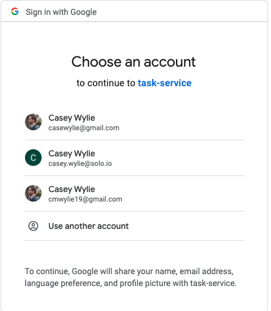
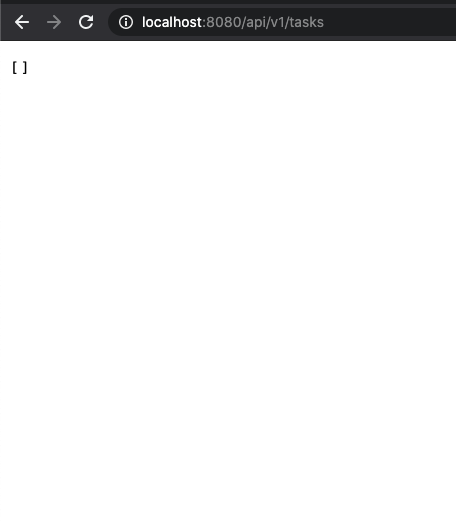

# Authentication with Google      
_During this scenario we are going make users log into google in order to use our `Task` Nodejs app. We will use an Open ID Connect flow to redirect users back to our app with an `id_token` and an `access_token`._


## Background
The setup and installation of `glooctl` and `Gloo Edge` may be redundant if you have been following along in the previous scenarios, but I am going to start off assuming that you have **NOT**. If you already have `glooctl` and `Gloo Edge Enterprise` installed, [skip to Deploy Task-Service in Kubernetes](#deploy-task-service-in-kubernetes)

If you have been following along, and you already have `glooctl` installed, and `Gloo Edge enterprise` installed, please skip to *Deploying Task-Service in Kubernetes*.

Authentication with Gloo Edge using OIDC flow requires using the enterprise version of Gloo Edge. 
The easiest way to install Gloo Edge, is through the `glooctl` command line tool.

To install `glooctl`, execute the command below which downloads the binary and installs it in your path.

```
curl -sL https://run.solo.io/gloo/install | sh
export PATH=$HOME/.gloo/bin:$PATH
```

For our Task-Service Nodejs app to use Gloo Edge ExtAuth. _This feature is only available in the enterprise version of Gloo Edge._ You must get an enterprise API Key for this part.

```
glooctl install gateway enterprise --license-key=<license-key>
```

## Steps
- [Deploy `Task-Service` in Kubernetes](#deploy-task-service-in-kubernetes)
- [Create and analyze a `VirtualService`](#create-and-apply-a-virtualservice)
- [Register your Application in Google](#register-your-application-in-google)
- [Create a CLIENT_SECRET secret](#create-a-client_secret-secret)
- [Create an AuthConfig](#create-an-authconfig)
- [Update Virtual Service to Use ExtAuth](#update-virtual-service-to-use-ExtAuth)
- [PortForward to 8080 and Test!](#portforward-to-8080-and-test)
- [Logging](#logging)
- [Cleanup](#cleanup)

## Deploy `Task-Service` in Kubernetes
Just a little background- Task-Service is a dead simple Nodejs app with 6 endpoints, built to abstract away the complexities of a complicated app so you can focus _ONLY_ on Gloo Edge features and functionalities by applying them to the app.

More information on the app can be found in the [`server.js`](https://github.com/cmwylie19/task-service/blob/master/server.js) file and the [`README.md`](https://github.com/cmwylie19/task-service/blob/master/README.md).

Lets go ahead and deploy the application into kubernetes, if you need a refresher on how to deploy an application into Kubernetes, checkout the first Scenario, [DeployInK8s](https://github.com/cmwylie19/task-service/blob/master/Scenarios/DeployInK8s.md) file and the [`README.md`](https://github.com/cmwylie19/task-service/blob/master/README.md), 
```
kubectl apply -f k8s/task-service.yaml
```

Once the task-service has a status of `RUNNING` you are done with this step
```
kubectl get pods
```
_or_ if you have `watch` installed on your system
```
watch kubectl get pods
```

## Create and apply a `VirtualService`
We are going to use a virtual service that we created during the [Rewriting Routes Scenario](https://github.com/cmwylie19/task-service/blob/master/Scenarios/TrafficManagement-RewriteRoutes.md).

The only difference is that we updated the `/api/v1/healthz` endpoint to be `/callback`, the endpoint will _still_ route to the same upstream route on the application of `/check/healthz`.

Go ahead and get a review of the Virtual Service:
```
less k8s/vs-oauth.yaml
```

Now lets go ahead and apply the Virtual Service.
```
kubectl apply -f k8s/vs-oauth.yaml
```

Now that we have applied our Virtual Service, lets take a look at it with `glooctl` to look at the routes:
```
glooctl get vs default
```

output:
```
+-----------------+--------------+---------+------+----------+-----------------+---------------------------------------+
| VIRTUAL SERVICE | DISPLAY NAME | DOMAINS | SSL  |  STATUS  | LISTENERPLUGINS |                ROUTES                 |
+-----------------+--------------+---------+------+----------+-----------------+---------------------------------------+
| default         |              | *       | none | Accepted |                 | /callback ->                          |
|                 |              |         |      |          |                 | gloo-system.default-task-service-8080 |
|                 |              |         |      |          |                 | (upstream)                            |
|                 |              |         |      |          |                 | /api/v1/create ->                     |
|                 |              |         |      |          |                 | gloo-system.default-task-service-8080 |
|                 |              |         |      |          |                 | (upstream)                            |
|                 |              |         |      |          |                 | /api/v1/tasks ->                      |
|                 |              |         |      |          |                 | gloo-system.default-task-service-8080 |
|                 |              |         |      |          |                 | (upstream)                            |
|                 |              |         |      |          |                 | /api/v1/tasks/ ->                     |
|                 |              |         |      |          |                 | gloo-system.default-task-service-8080 |
|                 |              |         |      |          |                 | (upstream)                            |
```

You can see the output of the routes.

Lets test our new `/callback` route, which is mapped to the `/check/healthz` endpoint on the app just to make sure everything is working as expected.

```
curl $(glooctl proxy url)/callback
```

You should receive an output of `pong!`

## Register your Application in Google
For this section I am just going to copy and paste from the [Gloo Edge Security Docs under Authentication and Authorization/Ext Auth/OAuth/Authenticate with Google](https://docs.solo.io/gloo-edge/latest/guides/security/auth/extauth/oauth/google/). The explanantion is very straight forward:

In order to use Google as our identity provider, we need to register our application with the Google API. To do so:

- Log in to the Google Developer Console
- If this is the first time using the console, create a project as prompted;
- Navigate to the OAuth consent screen menu item
- Input a name for your application in the Application name text field and select Internal as the _Application type_
- Click **Save**;
- Navigate to the Credentials menu item
- click Create credentials, and then OAuth client ID
- On the next page, select Web Application as the type of the client (as we are only going to use it for demonstration purposes),
- Enter a name for the OAuth client ID or accept the default value
- Under _Authorized redirect URIs_ click on Add URI
- Enter the URI: http://localhost:8080/callback
- Click Create

You will be presented with the client id and client secret for your application. Let’s store them in two environment variables:

```
CLIENT_ID=<your client id>
CLIENT_SECRET=<your client secret>
```

## Create a `CLIENT_SECRET` secret
Gloo Edge expects the client secret  to be stored in a Kubernetes secret. Let's create the secret using the `CLIENT_SECRET` variable:
```
glooctl create secret oauth --namespace gloo-system --name google --client-secret $CLIENT_SECRET
```

Lets double check and look at the secret we just created:
```
kubectl get secret google -n gloo-system -o yaml
```

```
kubectl describe secret google -n gloo-system 
```

## Create an AuthConfig
It is the AuthConfig that is going to secure our Virtual Service.

The fields in this `AuthConfig` are created using the information that we got when we registered our application with Google in an earlier step.

```
apiVersion: enterprise.gloo.solo.io/v1
kind: AuthConfig
metadata:
  name: google-oidc
  namespace: gloo-system
spec:
  configs:
  - oauth2:
      oidcAuthorizationCode:
        app_url: http://localhost:8080
        callback_path: /callback
        client_id: <CLIENT_ID>
        client_secret_ref:
          name: google
          namespace: gloo-system
        issuer_url: https://accounts.google.com
        session:
          cookieOptions:
            notSecure: true
        scopes:
        - email
```

Notice that this `AuthConfig` references the secret that we just created: `spec.configs.oauth2[0].oidcAuthorizationCode.client_secret_ref`.

Copy the above AuthConfig into a file:
```
nano authconfig-google-oidc.yaml
```
Paste in the code and **UPDATE YOUR CLIENT ID**

## Update Virtual Service to use ExtAuth
Now, lets edit our `k8s/vs-oauth.yaml` and tell the routes to use our `AuthConfig` `google-oidc`.

first lets describe our authconfig:
```
kubectl describe authconfig google-oidc -n gloo-system
```

Now, on the `routes` level of the yaml. We are going to add:
```
options:
  extauth:
    configRef:
      name: google-oidc
      namespace: gloo-system
```

You can highlight the commented area at the bottom of `k8s/vs-oauth.yaml` and uncomment all at once.

Once updated, run `kubectl apply -f k8s/vs-oauth.yaml --dry-run=client` to make sure there are not errors, then run:
```
kubectl apply -f k8s/vs-oauth.yaml
```

We now have our Routes protected by the `AuthConfig` which references our `CLIENT_SECRET`.


## PortForward to 8080 and Test!
If we do the command, `glooctl proxy url` we will see the address of our `Gateway Proxy` to our application.
```
➜ glooctl proxy url
http://localhost:80
```
Problem is that google is redirecting to port 8080!

To make our `Gateway Proxy` listen on 8080 we will issue a `kubectl port-forward` command:
```
kubectl port-forward -n gloo-system deploy/gateway-proxy 8080
```

Now, in a browser, http://localhost:8080/api/v1/tasks, which is the endpoint that displays all tasks.

First thing you will notice is that you have been redirected to Google to Login. 


Upon Logging in, you will be redirected to the `get all tasks` endpoint `/api/v1/tasks`, and considering we currently have no tasks, we will see an empty array.



## Logging 
To view the Auth Server logs on Kubernetes run the following command:
```
kubectl logs -n gloo-system deploy/extauth -f
```

## Cleanup
```
kubectl delete virtualservice -n gloo-system default
kubectl delete authconfig -n gloo-system google-oidc
kubectl delete secret -n gloo-system google
kubectl delete -f k8s/task-service.yaml
```